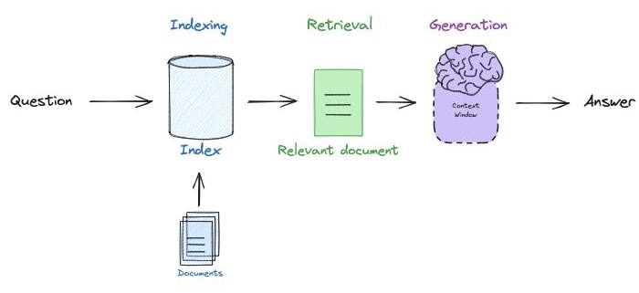

# YouTube Video RAG API with LangChain

This project implements a Retrieval-Augmented Generation (RAG) API for answering questions about YouTube videos using their transcripts. It leverages [LangChain](https://python.langchain.com/), FAISS vector store, and a Large Language Model (LLM) to provide context-aware answers.

---

## How It Works

### 1. Transcript & Metadata Retrieval

- The API fetches the transcript for a given YouTube video ID using `youtube_transcript_api`.
- Video metadata (title, published date, channel) is fetched using the YouTube Data API.

### 2. Text Splitting

- The transcript is split into overlapping chunks using LangChain's `RecursiveCharacterTextSplitter` (e.g., 1000 characters with 200 overlap).
- This ensures each chunk is semantically meaningful and fits within LLM context limits.

### 3. Embedding & FAISS Vector Store

- Each chunk is embedded into a vector using `GoogleGenerativeAIEmbeddings`.
- Embeddings and their corresponding text chunks are stored in a FAISS vector store for efficient similarity search.
- FAISS enables fast retrieval of the most relevant transcript chunks for any query.

### 4. Exponential Retry for Embedding

- Embedding APIs can hit quota/rate limits, causing failures.
- To handle this, the code uses the `tenacity` library's `@retry` decorator with exponential backoff.
- If a `ResourceExhausted` error occurs (quota/rate limit), the function waits and retries, increasing the wait time exponentially up to a maximum number of attempts.
- This makes the system robust and reliable, reducing failures due to temporary API limits.

### 5. Retrieval

- When a user asks a question, the API embeds the question and performs a similarity search in the FAISS vector store.
- The top-k most relevant transcript chunks are retrieved as context for the answer.

### 6. Answer Generation with LLM

- The retrieved context, video metadata, and the user's question are formatted into a prompt using a `PromptTemplate`.
- This prompt is sent to a Large Language Model (LLM) such as Gemini via LangChain's LLM interface.
- The LLM generates a detailed, context-aware answer, strictly based on the provided transcript context.

### 7. FastAPI Endpoint

- The `/ask` endpoint accepts a JSON payload with `video_id` and `question`.
- It returns a JSON response with the generated answer.

---

## Importance of Exponential Retry

APIs for embedding (like Google Generative AI) often have strict rate or quota limits. If you exceed these, requests will fail with errors such as `ResourceExhausted`. Instead of failing immediately, this project uses exponential backoff retry logic:

- **How it's handled:**  
  The `get_embeddings_with_retry` function is decorated with `@retry` from the `tenacity` library.
  - On `ResourceExhausted`, it waits (starting at 4 seconds, doubling up to 10 seconds), then retries, up to 5 times.
  - If all retries fail, the error is raised and handled gracefully.
- **Why it's important:**
  - Prevents transient API failures from breaking the workflow.
  - Maximizes the chance of successful embedding, especially under heavy load or quota constraints.
  - Makes the API more robust and production-ready.

---

## Chat History and Context Carrying

This RAG API implementation maintains a chat history for each video session to help carry context across multiple user queries. The chat history is managed using a Python dictionary (`chathistory`) where each key is a video ID and the value is a list of message objects (system, human, and AI messages).

**How it works:**

- For every new question about a video, the system:
  - Adds the current prompt (system message) and user question (human message) to the chat history for that video.
  - After the LLM generates an answer, it is also appended as an AI message.
- This approach allows the system to maintain conversational context, enabling follow-up questions to be answered more accurately by referencing previous exchanges.
- The chat history can be extended to include more advanced conversational memory or context windowing as needed.

**Why it's important:**

- Carrying context is crucial for multi-turn conversations, where users may ask follow-up questions or refer to previous answers.
- It improves the user experience by making the assistant more coherent and context-aware, especially for complex topics discussed across several

---

## Rag architecture



---

## Example Flow

1. **User sends a POST request** to `/ask` with a YouTube video ID and a question.
2. **Transcript and metadata are fetched** (and cached for future requests).
3. **Transcript is split** into chunks and embedded (with exponential retry for robustness).
4. **Chunks are stored/retrieved** from FAISS.
5. **Relevant chunks are retrieved** for the question.
6. **LLM generates an answer** using the context and metadata.
7. **API returns the answer** to the user.

---

## Setup

1. Clone the repository.
2. Install dependencies:
   ```sh
   pip install -r requirements.txt
   ```
3. Set up your `.env` file with the required API keys:
   ```
   YOUTUBE_API_KEY=your_youtube_api_key
   GOOGLE_API_KEY=your_google_genai_api_key
   ```
4. Run the API:
   ```sh
   uvicorn rag:app --reload
   ```

---

## Example Request

```json
POST /ask
{
  "video_id": "Gfr50f6ZBvo",
  "question": "What is AlphaFold and how does it work?"
}
```

---
